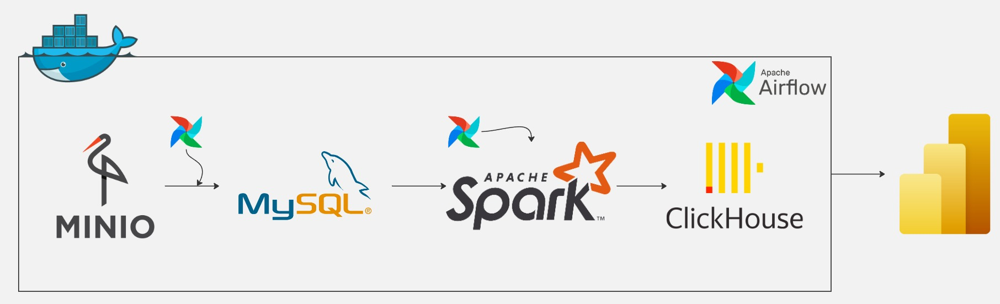
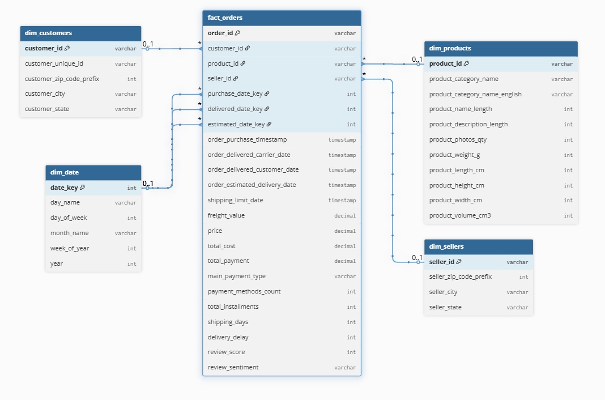
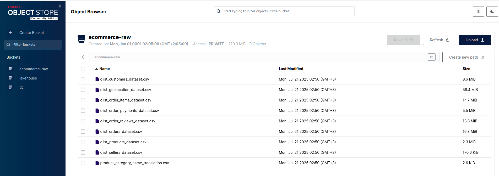
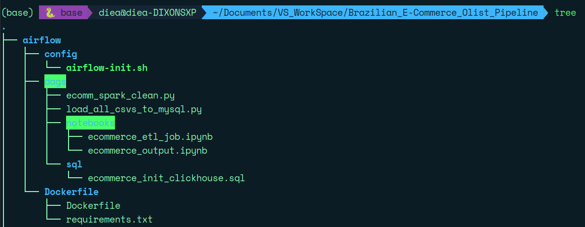
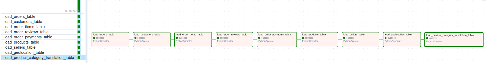
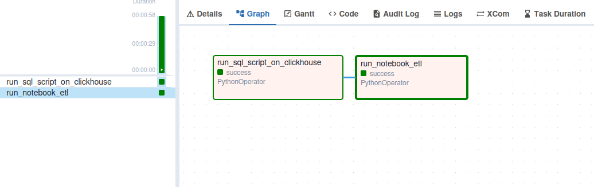
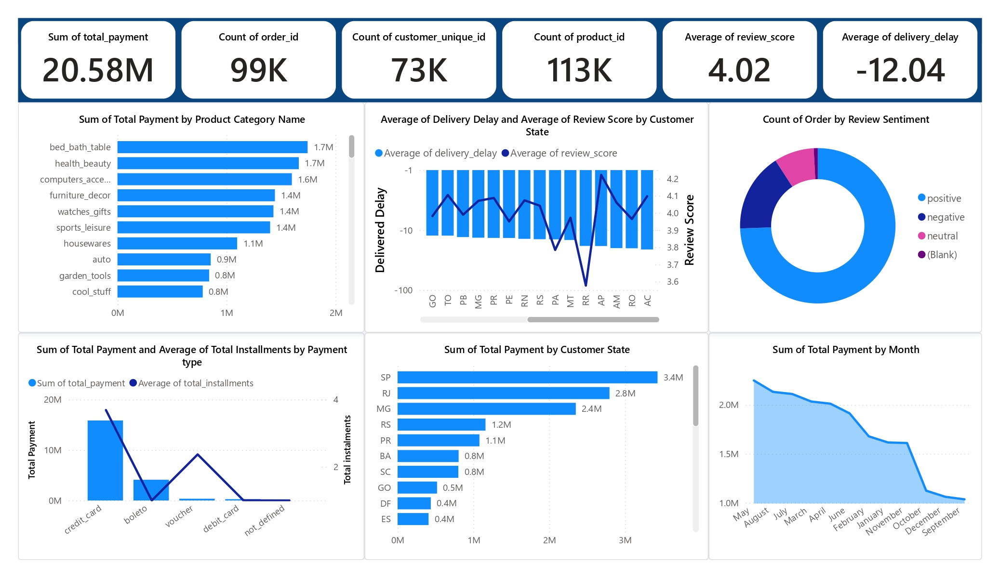

# 🚀 Brazilian E-Commerce Data Pipeline (End-to-End)

## 🌟 Overview

Build a fully-automated **Data Engineering pipeline** powered by modern open-source tools like **Apache Airflow**, **Apache Spark**, **MinIO**, **MySQL**, **ClickHouse**, and **Power BI**.

It ingests real-world e-commerce data from Kaggle and turns it into clean, modeled insights ready for BI dashboards — all orchestrated via Docker Compose.

🎯 **Goal**: From raw CSVs → automated ETL → star schema → blazing fast analytics → stunning dashboards.

---

## 🧱 Architecture

> End-to-End pipeline from ingestion to visualization
  


---

## 🧬 Data Modeling

> Modeled using a Star Schema in Apache Spark

- **Fact Table**: `orders`
- **Dimension Tables**:
  - `customers`
  - `products`
  - `sellers`
  - `geolocation`
  - `date`

  
---

## 📊 Power BI Dashboard

> Bringing the data to life through rich visualizations


### Key Insights:

- 📈 **Sales trends** across time
- 🌍 **Orders by state & city**
- 🛒 **Popular products & categories**
- 🚚 **Delivery performance & delays**
- 👤 **Customer behavior & segments**

---

## 🔄 ETL Pipeline: Step-by-Step

1. **Ingest** raw CSV files from [Kaggle Dataset](https://www.kaggle.com/datasets/olistbr/brazilian-ecommerce) into **MinIO**.
2. **Airflow DAG** uploads and stages data into **MySQL**.
3. **Apache Spark** reads, cleans, transforms, and builds the star schema.
4. Another **Airflow DAG**:
   - Creates ClickHouse schema (DB + tables)
   - Runs the Spark ETL notebook/script to load final data
5. **Power BI** connects to ClickHouse for dashboarding.

---

## 🛠️ Tech Stack

| Tool              | Role                          |
| ----------------- | ----------------------------- |
| 🐳 Docker Compose | Container orchestration       |
| 🪣 MinIO          | Object storage (raw files)    |
| 🐬 MySQL          | Staging database              |
| 🌀 Apache Airflow | Workflow orchestration (DAGs) |
| ⚡ Apache Spark    | ETL + data modeling engine    |
| 🟨 ClickHouse     | Fast OLAP DB for analytics    |
| 📊 Power BI       | Dashboard & reporting         |

---
## 🪣 MinIO

---
## 🌀 Apache Airflow




---

## 🚀 How to Run It Locally

> Make sure you have **Docker & Docker Compose** installed.

```bash
# Start all services
docker compose up -d

# Open Airflow UI:
http://localhost:8084

# Access JupyterLab (Spark ETL)
http://localhost:8888

# Explore ClickHouse data:
http://localhost:8123
```

> 💡 Power BI connects directly to ClickHouse for blazing-fast querying

  
---

## 🙏 Credits

- 📦 Dataset: [Brazilian E-Commerce - Kaggle](https://www.kaggle.com/datasets/olistbr/brazilian-ecommerce)
- 🖼️ Icons & Logos: Official branding of respective tools
- 📈 Dashboard: Built with ❤️ using Power BI

---

> Designed and built with passion by Diea 💪

